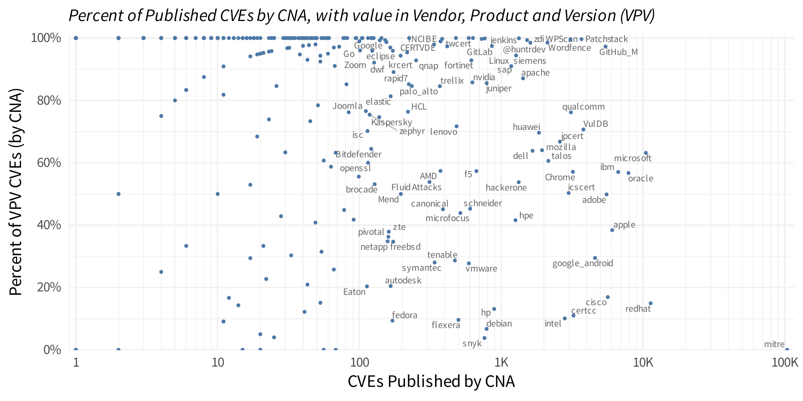
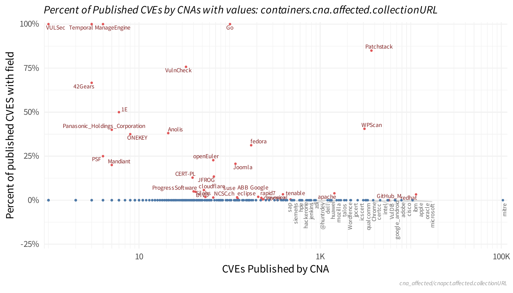
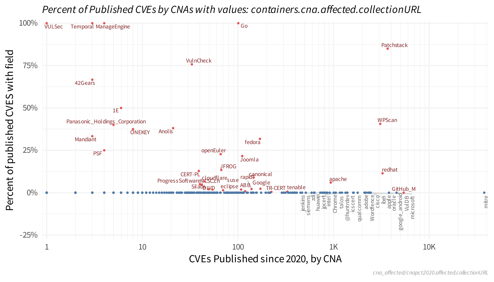
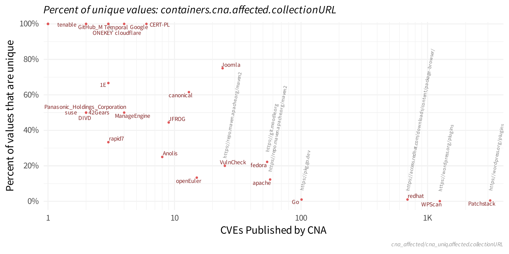

---
params:
  img_slug: "cna_affected"
output:
  github_document:
    toc: FALSE
    toc_depth: 2
---

# Detailed view of Affected Products (container.cna.affected)

This view is specifically focused on `container.cna.affected`.  The table below shortened all of the variables
so the `container.cna.` portion is truncated. 

 * `JSON Field` is the compound name of the JSON data element
 * `CVEs` count of unique CVE identifiers with the `JSON Field`
 * `CVE Percent` percent of total CVEs 
 * `CNAs` count of unique CNA short names providing the `JSON Field`
 * `CNA Percent`  percent of total CVEs 
 * `JSON Type Discovered` the type of json data present in the data 
 * `JSON Schema` what the JSON schema defines the data to be, if this is not present there is no definition of the `JSON Field" in the JSON schema. 
 

## Affected vendor, product, version and/or package name or repository. 

These fields represent the minimum necessary to identify the vulnerable product(s) or software. The table below identifies 
How many CVEs and CNAs have non-null values in the field. One thing to note: the "version" is represented by a JSON object 
and this code looks for anything specified in the "versions" object while ignoring the 
`containers.cna.affected.versions.status` since almost every record had that value with nothing else specified in this section. 

## Are the vendor and product defined in the CPE dictionary? 

This grabs the CPE dictionary from [NVD](https://nvd.nist.gov/feeds/xml/cpe/dictionary/official-cpe-dictionary_v2.3.xml.gz) and will first check the value provided "as is" against the same value in the CPE dictionary. Second, it does a case-insensitive match against the defined values in the CPE. 

CPE Dict 2.3 has 21,666 unique vendors and 134,552 unique combinations of vendor and product. 

## When are CVEs published with vendor, product and version (VPV)?

This next plot treats a "complete" record if any of the "affected" records has a value
in the `vendor` AND `product` AND `versions`. It is not inspecting those fields for quality, 
just that something in present. Again, the `containers.cna.affected.versions.status` is being ignored. 

## Which CNAs are published more complete VPV values? 

This looks at the percent of CVEs with a complete VPV record from each CNA and compares against the total number of CVEs from that CNA. 

Take note just how many CNAs are across the bottom (or the lack of CNAs at the bottom). This indicates that almost every CNA has been able to produce a complete VPV record. 

`mitre` as a CNA really sticks out here. 

## Timing of complete VPV records without CVEs published by MITRE 

# collection URL

## affected.cpes

