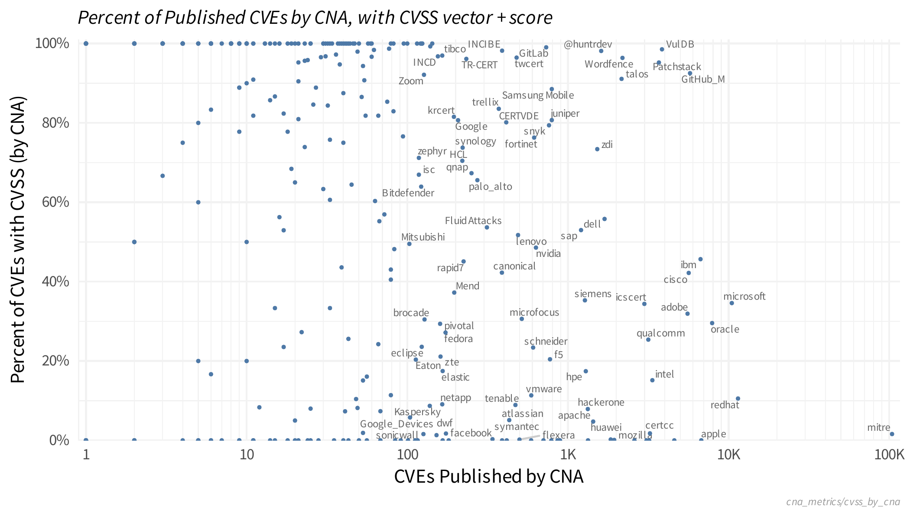
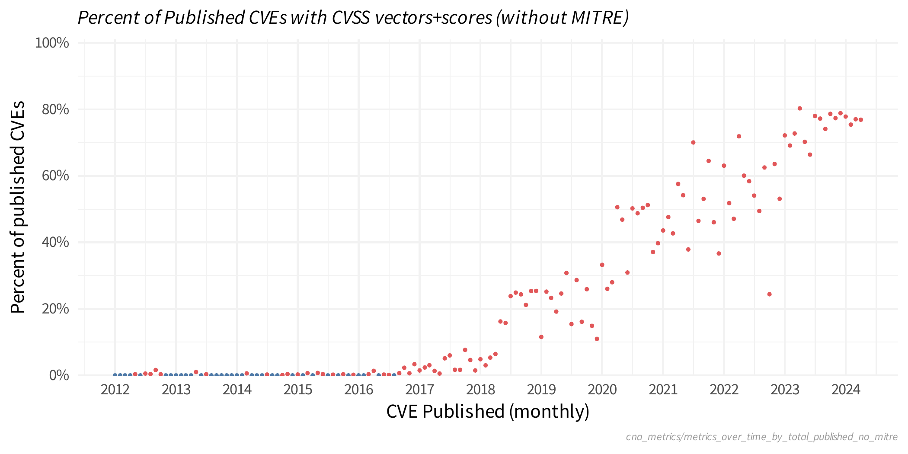

---
params:
  img_slug: "cna_metrics"
output:
  github_document:
    toc: FALSE
    toc_depth: 2
---


## Which CNAs are published more CVSS Vectors? 

This looks at the percent of CVEs with a CVSS record from each CNA and compares against the total number of CVEs from that CNA. 








```
## # A tibble: 1 × 2
##   cvss_vector_is_valid     n
##   <lgl>                <int>
## 1 TRUE                 59044
```


```
## Error in eval(expr, envir, enclos): object 'params' not found
```


```
## Error in eval(expr, envir, enclos): object 'params' not found
```


