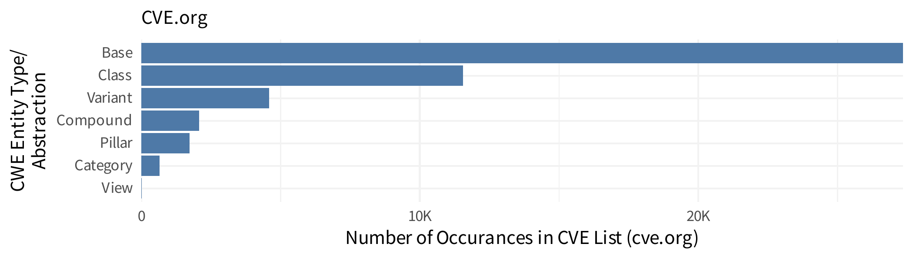
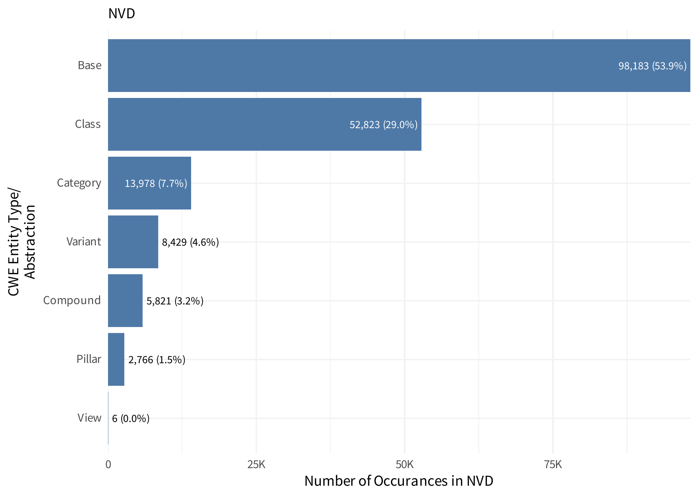

---
params:
  img_slug: "cna_problem_types"
output:
  github_document:
    toc: FALSE
    toc_depth: 2
---


```
## Rows: 231,211
## Columns: 8
## $ cve             <chr> "CVE-2007-2570", "CVE-2018-0929", "CVE-2023-5007", "CV…
## $ problemTypes_id <int> 1, 1, 1, 1, 1, 1, 1, 1, 1, 1, 1, 1, 1, 1, 1, 1, 1, 1, …
## $ descriptions_id <int> 1, 1, 1, 1, 1, 1, 1, 1, 1, 1, 1, 1, 1, 1, 1, 1, 1, 1, …
## $ description     <chr> NA, "Information Disclosure", "CWE-89 Improper Neutral…
## $ lang            <chr> "en", "en", "en", "en", "en", "en", "en", "en-US", "en…
## $ type            <chr> "text", "text", "CWE", "text", "text", "text", "CWE", …
## $ cweId           <chr> NA, NA, "CWE-89", NA, NA, NA, "CWE-522", "CWE-284", NA…
## $ cweid           <chr> NA, NA, NA, NA, NA, NA, NA, NA, NA, NA, NA, NA, NA, NA…
```

## Count of unique instances 


```
## # A tibble: 13,832 × 6
##    description                                 lang  type  cweId cweid instances
##    <chr>                                       <chr> <chr> <chr> <chr>     <int>
##  1 <NA>                                        en    text  <NA>  <NA>     133660
##  2 CWE-79 Improper Neutralization of Input Du… en    CWE   CWE-… <NA>       2844
##  3 Elevation of privilege                      en    text  <NA>  <NA>       1628
##  4 CWE-89 SQL Injection                        en    CWE   CWE-… <NA>       1579
##  5 CWE-352 Cross-Site Request Forgery (CSRF)   en    CWE   CWE-… <NA>       1504
##  6 CWE-79 Cross-site Scripting (XSS)           en    CWE   CWE-… <NA>       1479
##  7 Elevation of Privilege                      en    text  <NA>  <NA>       1333
##  8 Information disclosure                      en    text  <NA>  <NA>       1315
##  9 Remote Code Execution                       en    text  <NA>  <NA>       1296
## 10 Information Disclosure                      en    text  <NA>  <NA>       1277
## # ℹ 13,822 more rows
```

## containers.cna.problemTypes.descriptions.type


```
## # A tibble: 15 × 2
##    type                                                cves
##    <chr>                                              <int>
##  1 text                                              172575
##  2 CWE                                                47850
##  3 <NA>                                                5526
##  4 Impact                                              3344
##  5 cwe                                                  293
##  6 cvw                                                   46
##  7 RCE (Remote Code Execution)                           14
##  8 BASM (Broken Authentication & Session Management)      2
##  9 Improper Authorization                                 2
## 10 Injection                                              2
## 11 Security Misconfiguration                              1
## 12 problem_type                                           1
## 13 Information Disclosure                                 1
## 14 Other                                                  1
## 15 Stored XSS                                             1
```

containers.cna.problemTypes.descriptions.description


```
## # A tibble: 12,863 × 2
##    description                                                              cves
##    <chr>                                                                   <int>
##  1 <NA>                                                                   133689
##  2 CWE-79 Improper Neutralization of Input During Web Page Generation ('…   3494
##  3 Elevation of Privilege                                                   2447
##  4 Remote Code Execution                                                    2430
##  5 CWE-352 Cross-Site Request Forgery (CSRF)                                2014
##  6 Elevation of privilege                                                   1840
##  7 CWE-89 SQL Injection                                                     1714
##  8 Information Disclosure                                                   1713
##  9 Information disclosure                                                   1542
## 10 CWE-79 Cross-site Scripting (XSS)                                        1479
## # ℹ 12,853 more rows
```


```
## # A tibble: 13,546 × 3
##    type  description                                                        cves
##    <chr> <chr>                                                             <int>
##  1 text  <NA>                                                             133660
##  2 CWE   CWE-79 Improper Neutralization of Input During Web Page Generat…   2845
##  3 CWE   CWE-89 SQL Injection                                               1713
##  4 CWE   CWE-352 Cross-Site Request Forgery (CSRF)                          1694
##  5 text  Elevation of privilege                                             1628
##  6 CWE   CWE-79 Cross-site Scripting (XSS)                                  1479
##  7 text  Elevation of Privilege                                             1333
##  8 text  Information disclosure                                             1315
##  9 text  Remote Code Execution                                              1296
## 10 text  Information Disclosure                                             1277
## # ℹ 13,536 more rows
```


```
## Name: Weaknesses 
## Name: Categories 
## Name: Views 
## Name: External_References
```

```
## # A tibble: 9 × 3
##   x                        cves pct  
##   <chr>                   <int> <chr>
## 1 Weakness(1)             45161 96.0%
## 2 Weakness(2)              1125 2.4% 
## 3 Category(1)               628 1.3% 
## 4 Weakness(3)                91 0.2% 
## 5 Category(1),Weakness(1)    22 0.0% 
## 6 Weakness(4)                13 0.0% 
## 7 Weakness(5)                 7 0.0% 
## 8 View(1)                     6 0.0% 
## 9 Category(1),Weakness(2)     3 0.0%
```


```
## Error in knitr::include_graphics(.): Cannot find the file(s): "figs/cna_problem_types/cwe_in_practice.png"
```






```
## Error in eval(expr, envir, enclos): object 'params' not found
```

  
